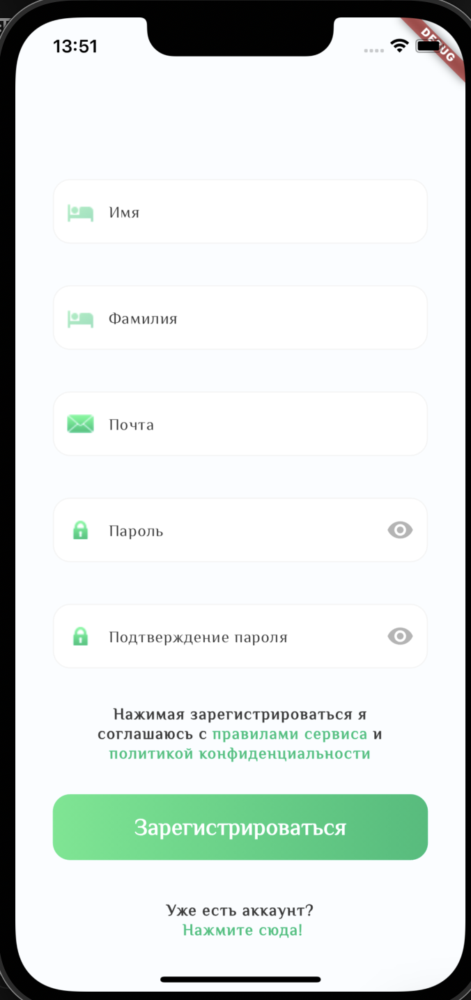
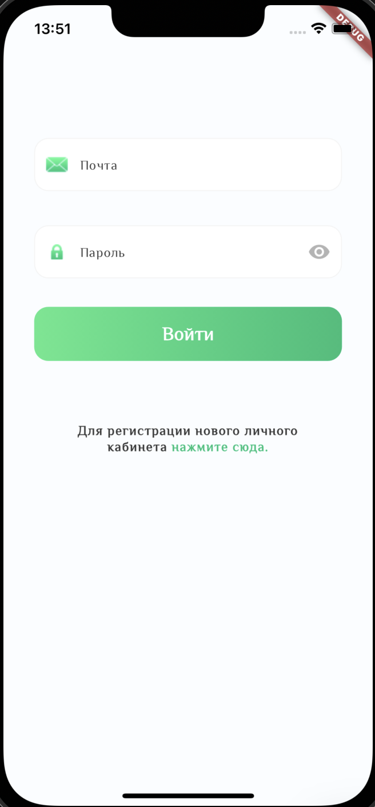
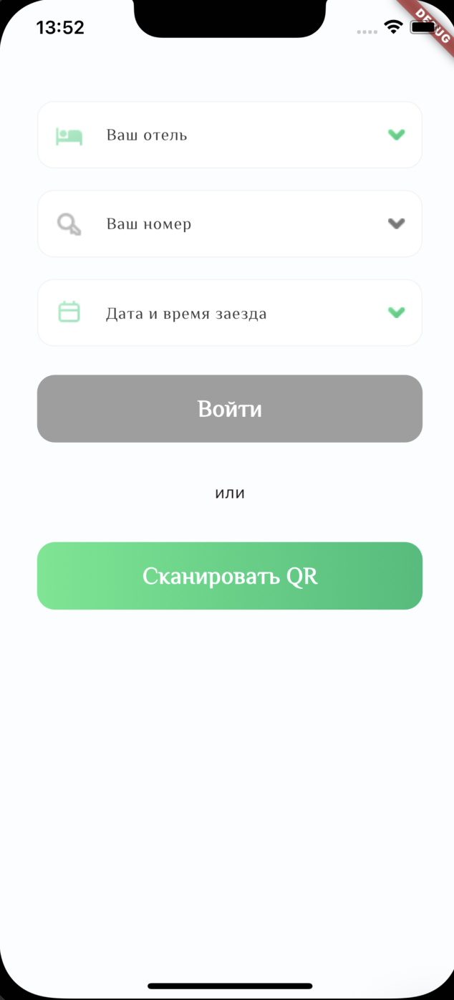
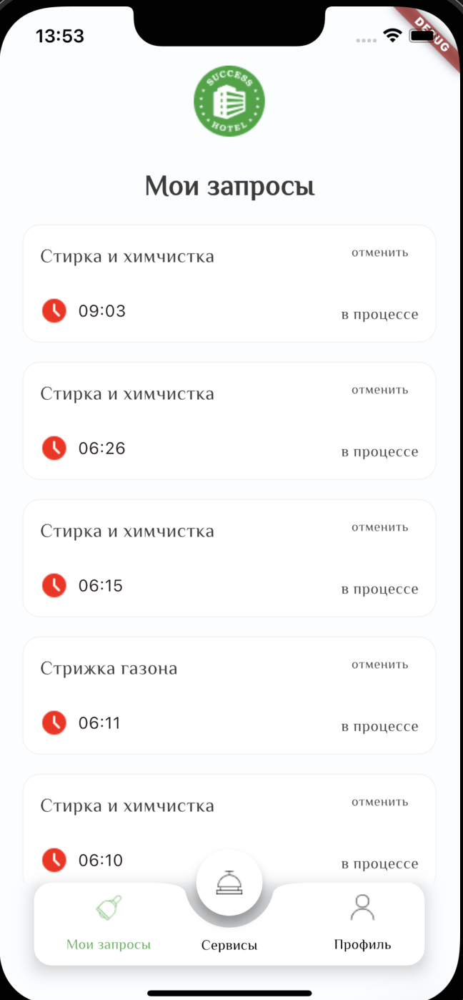
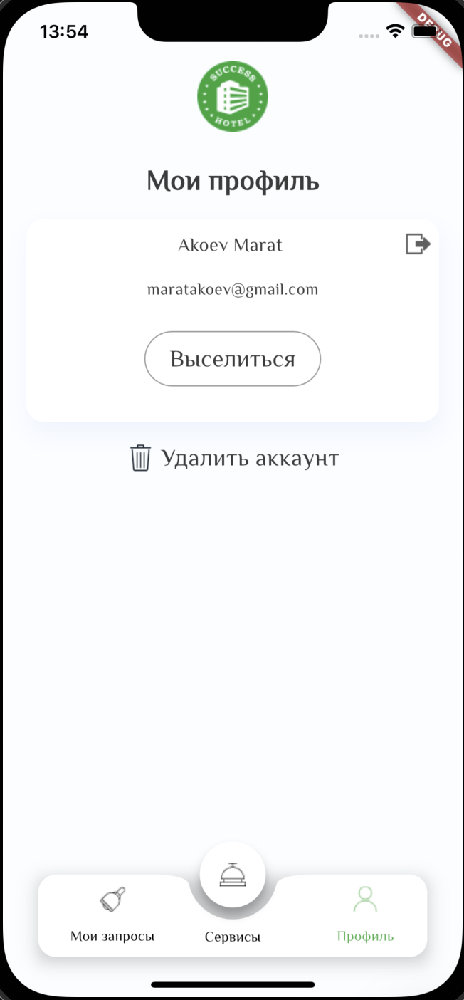

# HotelsApp for Clients
Flutter-приложение для клиентов отелей, позволяющее регистрироваться, авторизоваться, выбирать отель, номер а также заказывать, оплачивать различные услуги отеля в приложении.

## Основные функции
Регистрация и авторизация пользователей.
Возможна авторизация по QR-коду.
Возможность заказывать и оплачивать услуги отеля прямо в приложении.

## Использованные технологии
Flutter
Dart
Dio (для выполнения HTTP-запросов)
flutter_secure_storage (для безопасного хранения токенов)
DropDownButton_package (выпадающий список)
SreenShots/Регистрация в приложении.png
QRcodescanner

## Установка и запуск
Клонируйте репозиторий: https://github.com/maratakoev/Success-Hotels-for-guests.git
Установите зависимости Cocoapods
Установите пакеты из файла Pubspec.yaml

## Скриншоты

